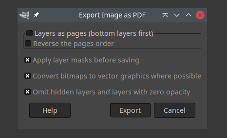

# code log: super-simple-png-to-pdf
super simple png to pdf using python

## Context

Once in a month I have to convert some png files to pdf.
For doing that, I've been using Gimp in a manual operation that involves:

1. create a new image using template A4 (300ppi)
2. change background color (optional)
3. import the target png image using "open as layers"
4. export to pdf

The entire process takes about 1 minute.

## Problem

I used to have about 5 to 10 files to convert, and I was ok with the manual process.
In the moment the figures increased to 25+ files, the manual process became a problem.

## Path to solution

To start the quest for a solution, I was looking for something that could be made programmatically. For convenience, I constrained my search to Python.

### Step 1: Pillow

Among some intuitive and unstructured web search I reached to this article [Image Processing in Python with Pillow](https://auth0.com/blog/image-processing-in-python-with-pillow/) from auth0 Blog, identifying Pillow as a natural resource to use.
From this, and with the help of [Pillow library documentation](https://pillow.readthedocs.io/en/stable/reference/Image.html), the following script was made to complete the task: see file [`sspng2pdf_pil.py`](sspng2pdf_pil.py).

The result was great, and the mission could have been concluded, except for the file size, which was almost two-fold the size obtained in the manual process using Gimp.

This lead me back to search, where I stumbled upon two potential parameters in save method: resolution and quality. It did influence file size, but it increased it. An experiment varying resolution and quality in the range [50, 150, 300] and [90, 95, 99], respectively, revealed that resolution did not affect file size. In addition, file size at quality 90 was increased by \~80% in relation to original png file.

### Step 2: The quest for decreased file size

I could have been satisfied with this algorithm, but the file size was intriguing me. So, I reviewed the manual process and something on the export dialog attracted my attention: the option "Convert bitmaps to vector graphics where possible".

This triggered a new direction of research.

### Step 3: Vector graphics and working with it

First, there is an essential concept about images.

> "Many artist-generated images frequently used in digital artwork (such as computer icons, comic book imagery, and simple graphic illustrations) consist of distinctly colored regions with piecewise continuous boundaries.
> For a range of historic reasons, many such images are still generated in raster, or bitmap formats" [[1]].

> "In computer graphics and digital photography, a raster graphic is a dot matrix data structure that represents a generally rectangular grid of pixels (points of color), viewable via a computer display, paper, or other display medium" [[2]].

Vector graphics formats are complementary to raster graphics, and it consists in encoding information about shapes and colors that comprise the image, which can allow for more flexibility in rendering [[3]].
Not surprising, raster images can be converted into vector graphics by software.

Again, among some intuitive and unstructured web search I reached to these articles:
- [Recommendations for converting raster images to vector graphics](https://stackoverflow.com/questions/188680/recommendations-for-converting-raster-images-to-vector-graphics);
- [Convert PNG to SVG using python](https://stackoverflow.com/questions/31427903/convert-png-to-svg-using-python).

It seems that vectorization has some high commercial value, since here we have more presence of proprietary software and algorithms, but we still do have free and open-source alternatives.

Among the free and open source, we have some options in the community (ex. [[4]]), but Cairo seemed to be a better choice [[5]], more a perception, much less a structural reasoning for decision making. (It is important to note here that things did not occur strictly and chronologically as this.)

From [[6], [7], [8]], it was possible to come up with the solution using pycairo, which amazingly resulted in a pdf file even smaller than that generated with the Gimp manual process. The following script completes the task: see file [`sspng2pdf_cairo.py`](sspng2pdf_cairo.py).

Mission accomplished!

[1]: http://www.cs.ubc.ca/labs/imager/tr/2018/PerceptionDrivenVectorization/perception-driven-vectorization.pdf
[2]: https://en.wikipedia.org/wiki/Raster_graphics
[3]: https://en.wikipedia.org/wiki/Computer_graphics#Vector_graphics
[4]: https://github.com/IngJavierR/PngToSvg
[5]: https://en.wikipedia.org/wiki/Cairo_(graphics)
[6]: https://stackoverflow.com/questions/7099630/create-pdf-with-resized-png-images-using-pycairo-rescaling-surface-issue
[7]: https://stackoverflow.com/a/16810331
[8]: https://www.cairographics.org/cookbook/pythoncairopil/